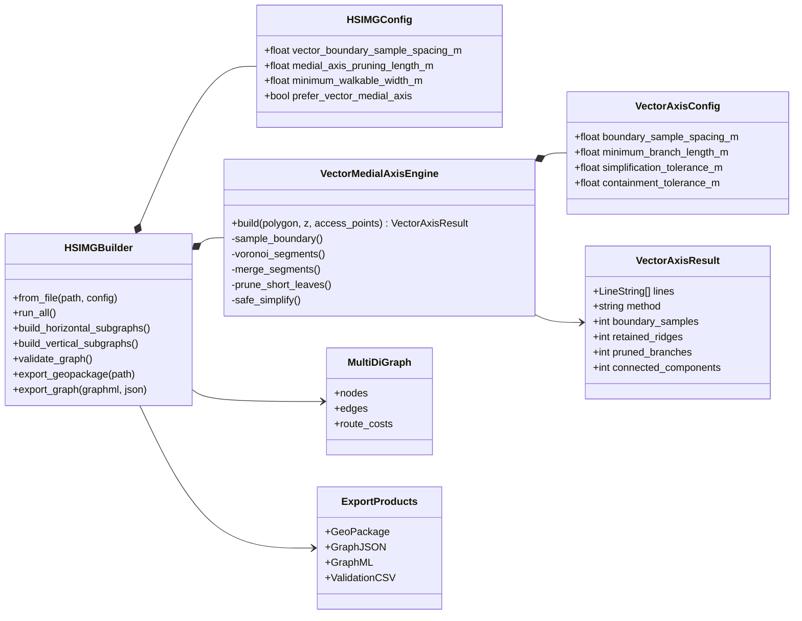
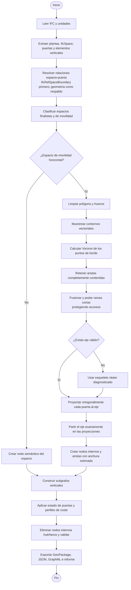

# HSIMG V3: arquitectura y subgrafos vectoriales

## Objetivo

V3 sustituye la esqueletización ráster como método principal por un eje medio
vectorial acotado por la geometría de cada `IfcSpace`. También reúne en una
única API pública la generación del grafo base y la semántica de puertas que en
las versiones anteriores estaban repartidas entre `hsimg.py` y `v2hsimg.py`.

La versión anterior no se modifica. Los nuevos puntos de entrada son:

- `v3hsimg.py`: modelo de datos, extracción IFC, construcción, validación y
  exportación del HSIMG.
- `v3vector.py`: algoritmo geométrico puro para crear el eje medio vectorial.
- `scripts/run_v3_export.py`: interfaz de línea de comandos reproducible.

`v3vector.py` no es un segundo proceso: es un componente geométrico aislado y
testeable que usa el constructor unificado `HSIMGBuilder`.

## Diagrama UML de componentes y clases


## Diagrama UML de actividad



## Por qué el método es más sólido

1. **No depende de una cuadrícula de píxeles.** La precisión se controla mediante
   el muestreo del contorno, no por una resolución ráster global.
2. **Respeta huecos y límites.** Solo se aceptan segmentos de Voronoi cubiertos
   por el polígono transitable; esto evita ejes y diagonales que atraviesen
   patios o muros.
3. **Las puertas se conectan localmente.** Cada nodo lateral se proyecta al
   punto más cercano del eje y el eje se divide en esa estación. No se conecta
   al nodo semántico remoto que representa todo el pasillo.
4. **La poda protege accesos.** Las ramas cortas se eliminan salvo cuando son
   necesarias para conservar el acceso más próximo a una puerta.
5. **No se exportan nodos internos huérfanos.** Una comprobación final elimina
   proyecciones o extremos que no participan en ninguna arista del eje.
6. **Conserva trazabilidad.** El método, los parámetros y sus diagnósticos se
   guardan en `mobility_axes` y en los metadatos de subgrafo.

## Mejoras de cálculo de rutas

### Implementadas en V3

- Estimación local de anchura en cada segmento del eje.
- Penalización de esfuerzo para tramos estrechos.
- Restricción de accesibilidad en silla de ruedas por anchura.
- Conservación de longitud 3D, pendiente, puertas cerradas y restricciones
  existentes en los perfiles de coste.
- Eliminación de nodos aislados que podían producir componentes artificiales.

### Recomendadas para una siguiente iteración

- **Contracción topológica:** conservar cruces, puertas y cambios de coste, pero
  fusionar cadenas de grado 2. Reduce mucho el tamaño del grafo sin alterar
  distancias.
- **Coste de giro:** añadir ángulo de entrada/salida en intersecciones para
  distinguir una ruta directa de otra con muchos cambios de dirección.
- **Holgura real:** sustituir la anchura aproximada por distancia a obstáculos y
  mobiliario cuando estos estén modelados.
- **Coste de transición:** representar por separado tiempo de apertura de
  puertas, espera de ascensor y transferencia entre plantas.
- **Rutas multiobjetivo:** mantener costes independientes de distancia, tiempo,
  esfuerzo y accesibilidad en vez de colapsarlos prematuramente en un único
  peso.
- **A\* jerárquico:** buscar primero entre nodos semánticos y expandir únicamente
  los subgrafos de movilidad atravesados por la ruta candidata.
- **Validación geométrica automática:** rechazar cualquier arista cuyo
  `LineString` no esté cubierto por el `IfcSpace` padre e informar su GUID.

## Ejecución

```powershell
.\.venv\Scripts\python.exe .\scripts\run_v3_export.py .\05_EPM_todo.ifc `
  --output-dir .\.qa\v3_full_run_05
```

Para una comparación controlada con el método anterior:

```powershell
.\.venv\Scripts\python.exe .\scripts\run_v3_export.py .\05_EPM_todo.ifc `
  --output-dir .\.qa\v3_raster_comparison --raster-axis
```
